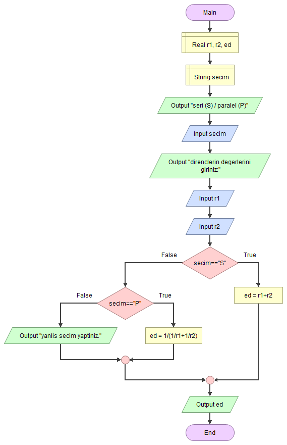
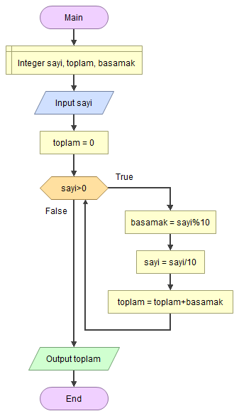
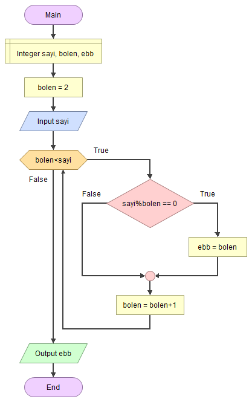
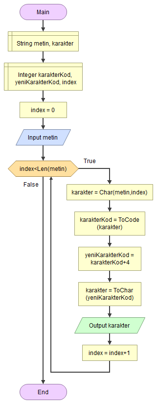

## Flowgorithm dokümantasyonu
http://www.flowgorithm.org/documentation/index.html

## Dairenin alan veya çevresi

## Seri-paralel direnç hesaplama

## Sayının rakamlarının toplamı

## Sayının en büyük böleni

## Sezar Şifrelemesi
Bu programda kullanılan fonksiyonlar: http://www.flowgorithm.org/documentation/intrinsic-functions.html

